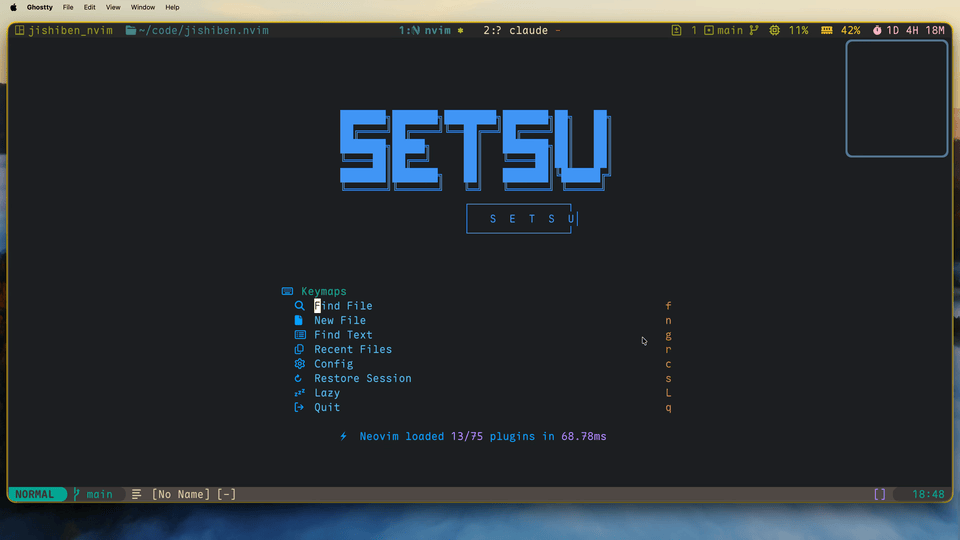

# jishiben.nvim

A lightweight notebook plugin for Neovim. Notes are stored in a single JSON file and displayed in a floating window as a markdown checkbox list.



## Features

- Single JSON file storage
- Floating window (popup) with markdown checkbox list
- Creation time displayed on each entry
- Toggle completion with `<CR>`, close with `q`
- [snacks.nvim](https://github.com/folke/snacks.nvim) picker integration (optional)

## Installation

### lazy.nvim

```lua
{
  "nicholasxjy/jishiben.nvim",
  event = "VeryLazy",
  opts = {
    win = {
      title = "JISHIBEN",
      width = 40,
    },
  },
  keys = {
    { "<leader>Ja", "<cmd>JishibenAdd<cr>", desc = "Jishiben Add" },
    { "<leader>Jp", "<cmd>JishibenOpen<cr>", desc = "Jishiben Open" },
    { "<leader>Jc", "<cmd>JishibenClear<cr>", desc = "Jishiben Clear" },
  },
}
```

### packer.nvim

```lua
use({
  "nicholasxjy/jishiben.nvim",
  config = function()
    require("jishiben").setup()
  end,
})
```

## Commands

| Command | Description |
| --- | --- |
| `:JishibenAdd [text]` | Add a note (prompts if text omitted) |
| `:JishibenOpen` | Open popup to display all notes |
| `:JishibenToggle` | Toggle checkbox in popup |
| `:JishibenPick` | Open notes in snacks.nvim picker |
| `:JishibenClear` | Clear all notes |

## Configuration

All options are optional. Below are the defaults:

```lua
require("jishiben").setup({
  storage_path = vim.fn.stdpath("data") .. "/jishiben.json",
  win = {
    title = " Jishiben ",
    title_pos = "center",
    border = "rounded",
    -- width = 80,
    -- height = 20,
  },
})
```

| Option | Type | Default | Description |
| --- | --- | --- | --- |
| `storage_path` | `string` | `stdpath("data") .. "/jishiben.json"` | Path to the JSON file |
| `win.title` | `string` | `" Jishiben "` | Popup title |
| `win.title_pos` | `string` | `"center"` | Title position |
| `win.border` | `string\|string[]` | `"rounded"` | Border style |
| `win.width` | `number\|nil` | `nil` | Window width (auto max 80) |
| `win.height` | `number\|nil` | `nil` | Window height (auto min 20) |

## Usage

```vim
:JishibenAdd buy milk
:JishibenAdd write report
:JishibenOpen
```

The popup displays:

```
- [ ] **buy milk**    2026-02-15 14:30
- [ ] **write report**    2026-02-15 14:35
```

Move the cursor to a line and press `<CR>` to toggle its status.

## Snacks Picker

If you have [snacks.nvim](https://github.com/folke/snacks.nvim) installed, you can use `:JishibenPick` to browse notes with the fuzzy picker. Press `<CR>` to toggle a note's done state.

```lua
-- lazy.nvim keys example
{ "<leader>Jf", "<cmd>JishibenPick<cr>", desc = "Jishiben Pick" },
```

You can also call it directly from Lua:

```lua
require("jishiben.picker").open()
```

## Development

```bash
make test
```

## License

MIT
