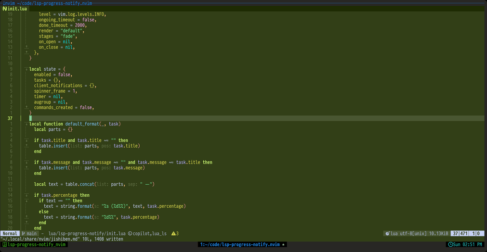

# jishiben.nvim

A lightweight notebook plugin for Neovim. Notes and todos live in separate markdown files and are edited from a two-pane TUI floating layout.



## Features

- Separate markdown files for notes and todos
- TUI layout with a left sidebar for `Notes` and `Todos`
- Right content pane opens the selected markdown file directly
- Quick note and todo capture
- Buffer-local mappings for switching files
- Markdown workflow stays compatible with normal text editing

## Installation

### lazy.nvim

```lua
{
  "nicholasxjy/jishiben.nvim",
  event = "VeryLazy",
  opts = {
    win = {
      title = "JISHIBEN",
      width = 40,
    },
  },
  keys = {
    { "<leader>Jp", "<cmd>JishibenOpen<cr>", desc = "Jishiben Open" },
    { "<leader>Jn", "<cmd>JishibenNote ", desc = "Jishiben Note" },
    { "<leader>Jt", "<cmd>JishibenTodo ", desc = "Jishiben Todo" },
    { "<leader>Jc", "<cmd>JishibenClear<cr>", desc = "Jishiben Clear" },
  },
}
```

### packer.nvim

```lua
use({
  "nicholasxjy/jishiben.nvim",
  config = function()
    require("jishiben").setup()
  end,
})
```

## Commands

| Command | Description |
| --- | --- |
| `:JishibenOpen` | Open the sidebar and markdown content pane |
| `:JishibenNote {text}` | Append raw text to the notes file |
| `:JishibenTodo {text}` | Append raw text to the todos file |
| `:JishibenClear` | Clear both markdown files |

## Configuration

All options are optional. Below are the defaults:

```lua
require("jishiben").setup({
  notes_path = vim.fn.stdpath("data") .. "/jishiben/notes.md",
  todos_path = vim.fn.stdpath("data") .. "/jishiben/todos.md",
  win = {
    title = " jishiben.nvim ",
    title_pos = "center",
    border = "single",
    -- width = 96,
    -- height = 24,
    -- row = 2,
    -- col = 10,
  },
})
```

| Option | Type | Default | Description |
| --- | --- | --- | --- |
| `notes_path` | `string` | `stdpath("data") .. "/jishiben/notes.md"` | Path to the notes markdown file |
| `todos_path` | `string` | `stdpath("data") .. "/jishiben/todos.md"` | Path to the todos markdown file |
| `win.title` | `string` | `" jishiben.nvim "` | Sidebar floating window title |
| `win.title_pos` | `string` | `"center"` | Title position |
| `win.border` | `string\|string[]` | `"single"` | Border style |
| `win.width` | `number\|nil` | `nil` | Total layout width (auto max 96) |
| `win.height` | `number\|nil` | `nil` | Layout height (auto max 24) |
| `win.row` | `number\|nil` | `nil` | Window row offset (auto centered) |
| `win.col` | `number\|nil` | `nil` | Window column offset (auto centered) |

## Usage

```vim
:JishibenOpen
```

`JishibenOpen` creates a left sidebar and a right content pane. The sidebar lists `Notes` and `Todos`; the right pane opens either `notes.md` or `todos.md` as a normal markdown buffer. Use any markdown structure you want.

Example `notes.md`:

```md
# Ideas

- Draft plugin README
```

Example `todos.md`:

```md
- [ ] write report
- call Alice
```

When the floating layout opens, normal editing happens in the right content pane. Add, reorder, or rewrite content with normal markdown editing commands. Press `q` to close both panes; modified content is written before closing.

Content pane mappings:

| Key | Action |
| --- | --- |
| `n` | Open `Notes` |
| `t` | Open `Todos` |
| `q` | Write modified content and close the floating layout |

Sidebar mappings:

| Key | Action |
| --- | --- |
| `<Enter>` | Open the selected sidebar section |
| `n` | Open `Notes` |
| `t` | Open `Todos` |
| `q` | Write modified content and close the floating layout |

`JishibenClear` wipes both markdown files while keeping the files themselves.

## Development

```bash
make test
```

## License

MIT
