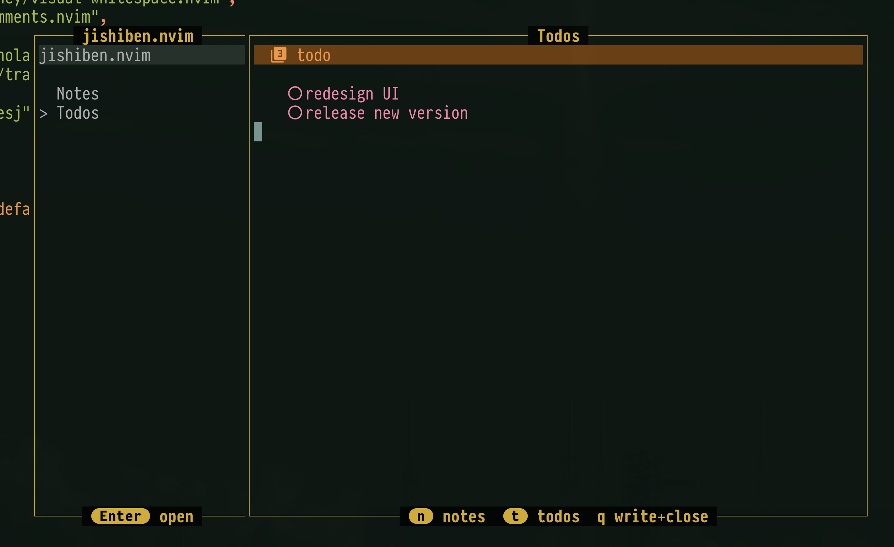

# jishiben.nvim

A lightweight notebook plugin for Neovim. Notes, todos, and prompts live in separate markdown files and are edited from a two-pane TUI floating layout.



## Features

- Separate markdown files for notes, todos, and prompts
- TUI layout with a left sidebar for `Notes`, `Todos`, and `Prompts`
- Right content pane opens the selected markdown file directly
- Send a visual selection from `Prompts` to a Sidekick agent
- Quick note and todo capture
- Buffer-local mappings for switching files
- Markdown workflow stays compatible with normal text editing

## Installation

### lazy.nvim

```lua
{
  "nicholasxjy/jishiben.nvim",
  event = "VeryLazy",
  dependencies = {
    {
      "folke/sidekick.nvim",
      opts = {},
    },
  },
  opts = {
    win = {
      title = "JISHIBEN",
      width = 40,
    },
  },
  keys = {
    { "<leader>Jp", "<cmd>JishibenOpen<cr>", desc = "Jishiben Open" },
    { "<leader>Jn", "<cmd>JishibenNote ", desc = "Jishiben Note" },
    { "<leader>Jt", "<cmd>JishibenTodo ", desc = "Jishiben Todo" },
    { "<leader>Jc", "<cmd>JishibenClear<cr>", desc = "Jishiben Clear" },
  },
}
```

Sending prompts requires [sidekick.nvim](https://github.com/folke/sidekick.nvim) with an AI CLI agent configured. Remove the `dependencies` block if you do not use prompt sending; the rest of jishiben.nvim works without Sidekick.

### packer.nvim

```lua
use({
  "nicholasxjy/jishiben.nvim",
  config = function()
    require("jishiben").setup()
  end,
})
```

## Commands

| Command | Description |
| --- | --- |
| `:JishibenOpen` | Open the sidebar and markdown content pane |
| `:JishibenNote {text}` | Append raw text to the notes file |
| `:JishibenTodo {text}` | Append raw text to the todos file |
| `:JishibenClear` | Clear all three markdown files |

## Configuration

All options are optional. Below are the defaults:

```lua
require("jishiben").setup({
  notes_path = vim.fn.stdpath("data") .. "/jishiben/notes.md",
  todos_path = vim.fn.stdpath("data") .. "/jishiben/todos.md",
  prompts_path = vim.fn.stdpath("data") .. "/jishiben/prompts.md",
  win = {
    title = " jishiben.nvim ",
    title_pos = "center",
    border = "single",
    -- width = 96,
    -- height = 24,
    -- row = 2,
    -- col = 10,
  },
})
```

| Option | Type | Default | Description |
| --- | --- | --- | --- |
| `notes_path` | `string` | `stdpath("data") .. "/jishiben/notes.md"` | Path to the notes markdown file |
| `todos_path` | `string` | `stdpath("data") .. "/jishiben/todos.md"` | Path to the todos markdown file |
| `prompts_path` | `string` | `stdpath("data") .. "/jishiben/prompts.md"` | Path to the prompts markdown file |
| `win.title` | `string` | `" jishiben.nvim "` | Sidebar floating window title |
| `win.title_pos` | `string` | `"center"` | Title position |
| `win.border` | `string\|string[]` | `"single"` | Border style |
| `win.width` | `number\|nil` | `nil` | Total layout width (auto max 96) |
| `win.height` | `number\|nil` | `nil` | Layout height (auto max 24) |
| `win.row` | `number\|nil` | `nil` | Window row offset (auto centered) |
| `win.col` | `number\|nil` | `nil` | Window column offset (auto centered) |

## Usage

```vim
:JishibenOpen
```

`JishibenOpen` creates a left sidebar and a right content pane. The sidebar lists `Notes`, `Todos`, and `Prompts`; the right pane opens `notes.md`, `todos.md`, or `prompts.md` as a normal markdown buffer. Use any markdown structure you want.

Example `notes.md`:

```md
# Ideas

- Draft plugin README
```

Example `todos.md`:

```md
- [ ] write report
- call Alice
```

Example `prompts.md`:

```md
Review this change for correctness and unnecessary complexity.

Explain the selected code and suggest a smaller implementation.
```

In `Prompts`, visually select any part of the file and press `<Enter>`. Jishiben sends the selection to the attached Sidekick agent with `submit = true`, then opens and focuses Sidekick. If no agent is attached, Sidekick prompts you to select one.

When the floating layout opens, normal editing happens in the right content pane. Add, reorder, or rewrite content with normal markdown editing commands. Press `q` to close both panes; modified content is written before closing.

Content pane mappings:

| Key | Action |
| --- | --- |
| `n` | Open `Notes` |
| `t` | Open `Todos` |
| `p` | Open `Prompts` |
| Visual `<Enter>` | Send the selection to Sidekick (only in `Prompts`) |
| `q` | Write modified content and close the floating layout |

Sidebar mappings:

| Key | Action |
| --- | --- |
| `<Enter>` | Open the selected sidebar section |
| `n` | Open `Notes` |
| `t` | Open `Todos` |
| `p` | Open `Prompts` |
| `q` | Write modified content and close the floating layout |

`JishibenClear` wipes all three markdown files while keeping the files themselves.

## Development

```bash
make test
```

## License

MIT
